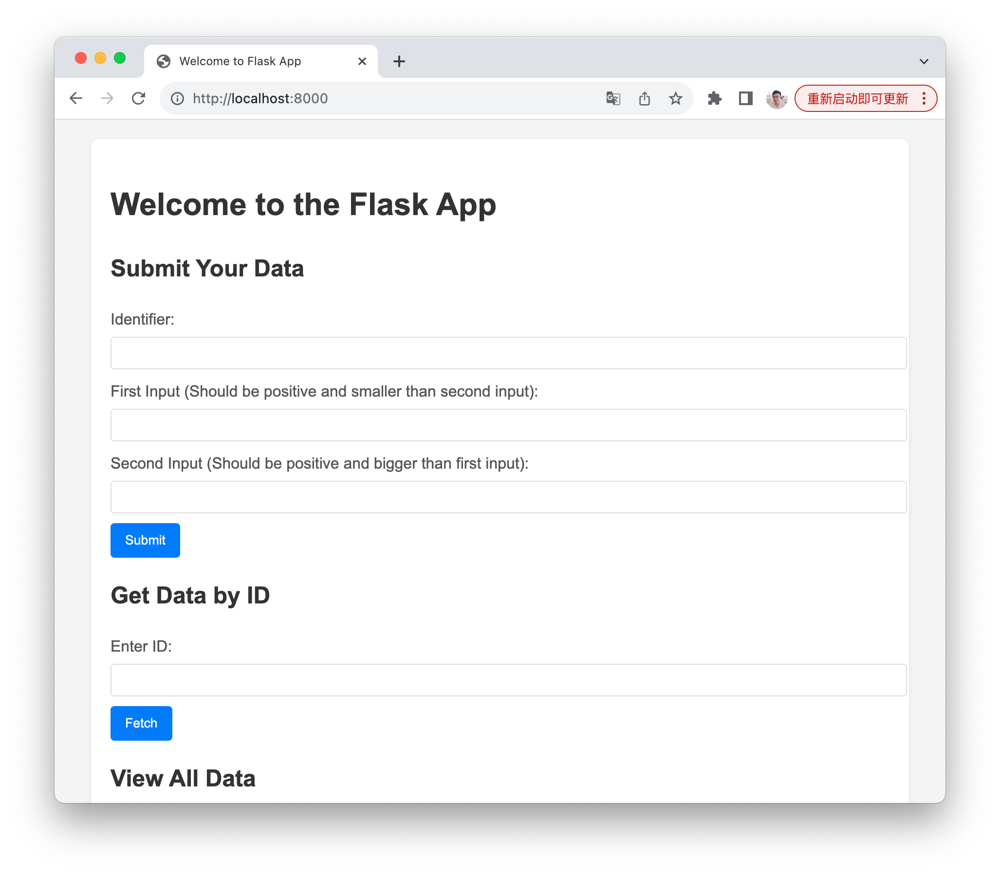
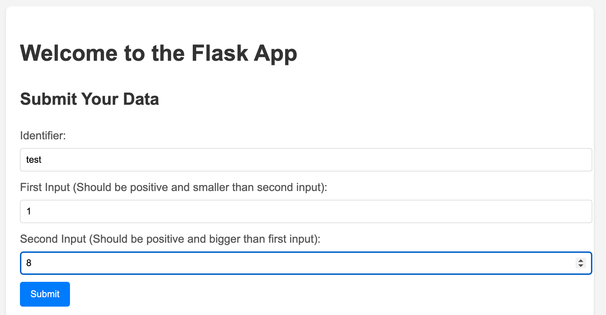
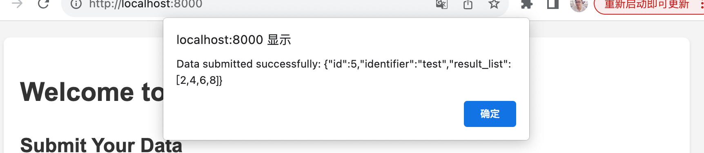
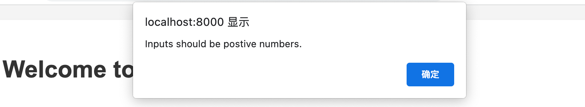
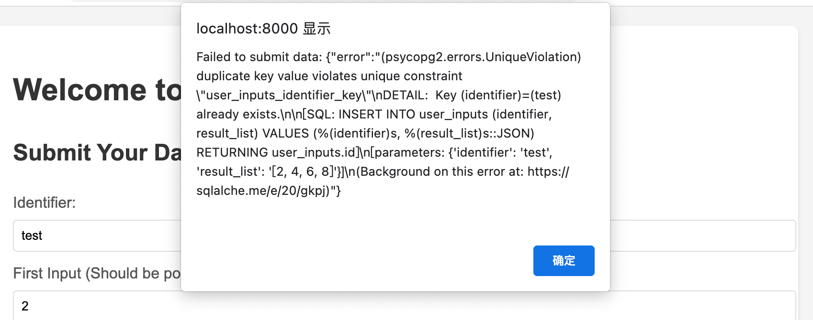
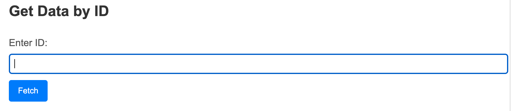
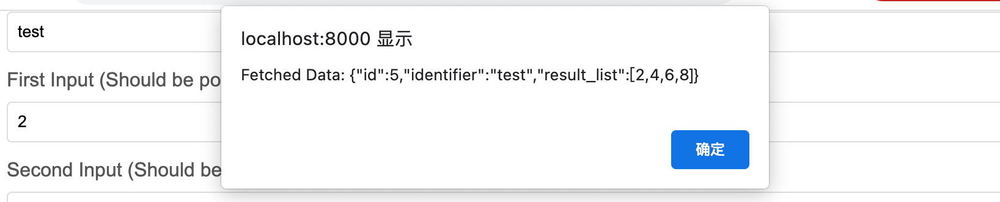
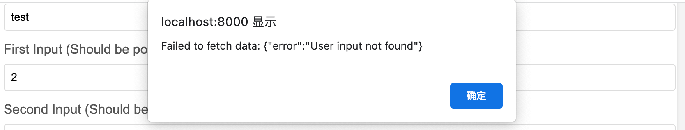
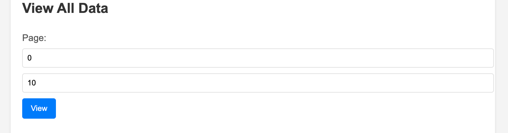
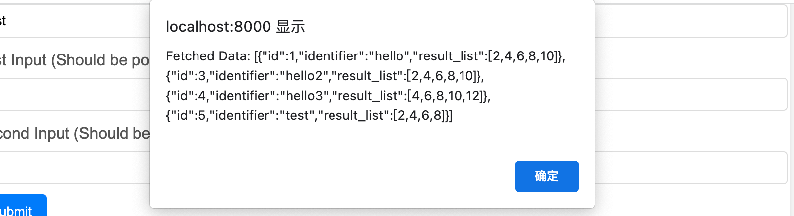

# Flask Full Stack APP
## How to run this repo:

clone this repository:
```
git clone https://github.com/putongyong/deep_opinion_project.git
```

go to main branch
```
git checkout main
```

**With docker:**

1. Build docker image:
```
make build
```

2. Start the Containers:
```
make up
```

3. Stop and Remove the Containers:
```
make down
```

4. Rebuild and Restart:
```
make rebuild
```

The app will be running at Localhost:8000:



**Three main sections**

1. Submit data

When the id, first input and second input are entered correctly, this will generate a new list and store it in the database:



You will get a result like this:



If the data is not provided correctly (with negaive integers, or in case of first input bigger than second input), you will get an alert and the data will not transfered to the server:



If the id has been stored in the database, you will also get an alert: 



2. get data by id

This is to retrieve any stored data by an id:



Case success:



Case fail:



3. View all data

This is to retrieve all stored data, with a pagination system to prevent having too much request at the same time to the database:



Result:



## Technologies

Language: **Python**
Framework: **Flask**
ORM: **SQLalchemy**
Test: **Pytest**
Containerization: **Docker**
Database: **Postgresql**

## What I have done

1. A CRUD web application to insert data to the database and retrieve it from the database.

2. Use Clean Architecture Structure to separate different functionalities:


3. A lightweight PostgreSQL database, generated by docker image, for testing. 

4. Documentations.

## What I can improve for this project

1. Use python tools like Alembic to improve database migration. This will help to update the database structure if we add new models, and it will provide a history of these updates.
2. Use authentification token to prevent users to send requests to the api endpoints directly.
3. Create a table for users and their roles. Theses will help to create different views if necessary.
4. Use uv or poetry to manage dependencies.

## What cloud technologies I would use and why.

I would use AWS or Azure as cloud plateform. The reason is that they are the most solid ones currently in the market.

I would use docker for containerizing the app, and kubernetes for controling containers.

The idea is that, containerization with docker provide isolation of different instances, and it will make they excutable in any infrastructure, as long as this infrastructure supports docker.

With kubernetes, we can have a better scalability and monitoring of the containers. For example, we can easily replace unhealthy containers by healthy ones, without letting go the logs from the previous containers (though this may need more configuration for persistent volume).